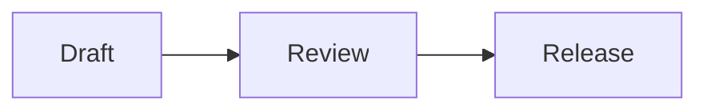
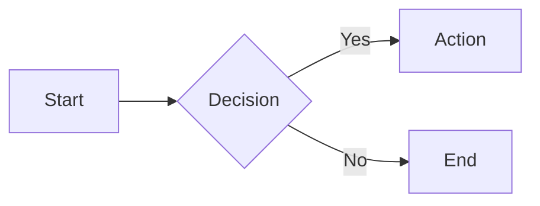

# mdv

终端下浏览 Markdown 的工具，支持 Mermaid 渲染。

`mdv` 是这个仓库的 CLI 名，也是现在的 npm 包名；底层同时提供 Mermaid 渲染库能力。

它的核心使用场景很直接：

- 用 `mdv` 在终端里阅读 Markdown
- 自动把 Markdown 里的 Mermaid 代码块渲染成终端可读的 ASCII / Unicode 图
- 在需要时继续把同一套 Mermaid 能力用到 SVG、CLI、Web UI 或 AI 工具链里


[](LICENSE)

[GitHub Repository](https://github.com/zhenhuaa/mdv)

## 目录

- [CLI 快速开始](#cli-快速开始)
- [CLI 命令说明](#cli-命令说明)
- [Markdown 渲染范围](#markdown-渲染范围)
- [Mermaid 支持](#mermaid-支持)
- [作为库使用](#作为库使用)
- [核心 API](#核心-api)

## 这是什么

这个仓库提供两层能力：

1. `mdv` CLI：在终端里查看 Markdown，并把 Mermaid 代码块直接转换成终端图形。
2. Mermaid 渲染库：把 Mermaid 渲染成 SVG 或 ASCII，方便在 Web、服务端、Agent、CLI 工具中复用。

如果你的主要目标是“在终端里舒服地看文档”，先看下面的 CLI 部分；如果你要集成到代码里，再看后面的 API。

## 为什么把 CLI 放到第一位

大多数 Markdown 工具只解决“显示文本”，大多数 Mermaid 工具只解决“画图”，但不解决“在终端里读文档”：

- Markdown 在终端里通常只剩纯文本
- Mermaid 代码块会原样显示，阅读成本很高
- `less` / `cat` 对表格、标题、引用块、代码块不够友好
- 终端工作流、AI 编程工作流、SSH 环境都很需要一个纯终端方案

`mdv` 的目标不是做一个通用浏览器，而是把 Markdown 文档的核心阅读体验补齐，尤其是 Mermaid。

## 特性

- Markdown 终端阅读：标题、列表、引用、表格、代码块会做终端友好的排版
- Mermaid 代码块渲染：自动将 ```` ```mermaid ```` 转成 ASCII / Unicode 图
- 适合终端工作流：支持文件输入、标准输入、分页器
- 样式可降级：可输出无 ANSI 样式的纯文本版本
- 底层 Mermaid 渲染库：支持 SVG 和 ASCII 两种输出
- 支持多种 Mermaid 图：Flowchart、State、Sequence、Class、ER、XY Chart

## 安装

### 作为 CLI 使用

当前 CLI 入口是：

- `mdv`

CLI 支持标准 Node 安装和执行，推荐这样安装和使用：

```bash
npm install -g mdv
mdv README.md
```

也可以在项目内安装后通过本地二进制使用：

```bash
npm install mdv
./node_modules/.bin/mdv README.md
```

### 作为库使用

如果你只是想把它当终端 Markdown 浏览器使用，看到这里其实就够了。下面这一段主要给代码集成场景。

```bash
npm install mdv
# or
bun add mdv
# or
pnpm add mdv
```

## CLI 快速开始

最常见的使用方式只有四种：

```bash
# 直接查看一个 Markdown 文件
mdv README.md

# 通过 stdin 读取
cat README.md | mdv -

# 使用分页器查看长文档
mdv --pager docs/architecture.md

# 输出无 ANSI 样式版本，适合重定向、日志、CI
mdv --no-style README.md
```

### CLI 做了什么

当 `mdv` 读取 Markdown 时，会先做一层 Mermaid 预处理：

1. 找出所有 ```` ```mermaid ```` 代码块
2. 尝试把 Mermaid 源码渲染成终端 ASCII / Unicode 图
3. 再把整个 Markdown 渲染成终端友好的文本样式

如果某个 Mermaid 代码块渲染失败，会保留原始 Mermaid 代码块，不会直接吞掉内容。

### 适合写进 README 的使用示例

示例输入：

````markdown
# 发布流程


````

终端里会直接看到渲染后的流程图，而不是原始 Mermaid 源码。

## CLI 命令说明

### Synopsis

```bash
mdv [OPTIONS] [FILE]
cat FILE | mdv -
mdv themes
mdv doctor
```

### Description

`mdv` 会读取 Markdown，先把 Mermaid fenced code block 预处理成终端图，再输出带终端样式的阅读结果。

如果输入来自文件，就读取 `[FILE]`；如果参数是 `-`，或者 stdin 被 pipe 进来，就从标准输入读取。

### Options

| 参数 | 说明 |
| --- | --- |
| `-n`, `--no-style` | 不输出 ANSI 样式；仍会把 Mermaid 转成 ```text 代码块，适合管道、日志、CI |
| `--no-mdv` | `--no-style` 的兼容别名 |
| `--no-glow` | 历史兼容别名，等价于 `--no-style` |
| `--no-mermaid` | 不渲染 Mermaid 图，保留原始 ` ```mermaid ` fenced code block |
| `--mermaid <render|source>` | 显式指定 Mermaid block 是渲染成图还是保留源码 |
| `--theme <name>` | 使用内置主题，作用于 Markdown 样式、代码高亮和 Mermaid ASCII 颜色；默认 `catppuccin-mocha` |
| `--list-themes` | 列出内置主题 |
| `--preview` | 配合 `mdv themes` 预览各主题的标题、正文、链接和代码样式 |
| `--color <auto|always|never>` | 控制 ANSI 颜色输出策略 |
| `--no-color` | 等价于 `--color never` |
| `doctor` | 输出当前 CLI 版本、主题、颜色模式、TTY 状态等诊断信息 |
| `-v`, `--version` | 显示当前 CLI 版本 |
| `-h`, `--help` | 显示帮助信息 |
| `-` | 从标准输入读取 Markdown |

### Built-in Themes

可通过 `mdv themes`、`mdv --list-themes` 或 `mdv themes --preview` 查看当前支持的主题：

- `zinc-light`
- `zinc-dark`
- `tokyo-night`
- `tokyo-night-storm`
- `tokyo-night-light`
- `catppuccin-mocha`（默认）
- `catppuccin-latte`
- `nord`
- `nord-light`
- `dracula`
- `github-light`
- `github-dark`
- `solarized-light`
- `solarized-dark`
- `one-dark`

### Help 输出

下面这段和当前 CLI 实现保持一致：

```text
mdv - terminal Markdown with Mermaid ASCII support

Usage:
  mdv [OPTIONS] [FILE]
  cat FILE | mdv -
  mdv themes
  mdv doctor

Options:
  -n, --no-style    Output raw Markdown with Mermaid rendered as ```text blocks
  --no-mermaid      Keep Mermaid fenced blocks as source instead of rendering
  --mermaid MODE    Use render or source for Mermaid fenced blocks
  --theme NAME      Use a built-in theme (default: catppuccin-mocha)
  --list-themes     List built-in themes
  --preview         Show theme previews with "mdv themes"
  --color MODE      Use auto, always, or never for ANSI colors
  --no-color        Disable ANSI colors
  -v, --version     Show mdv version
  -h, --help        Show this help message

Examples:
  mdv README.md
  cat README.md | mdv -
  mdv --theme dracula README.md
  mdv themes --preview
```

### Examples

```bash
# 查看当前目录下的设计文档
mdv docs/design.md

# 查看 git 中某个版本的 README
git show HEAD~1:README.md | mdv -

# 查看生成后的 Markdown
cat dist/release-notes.md | mdv -

# 用 Dracula 主题阅读
mdv --theme dracula docs/spec.md

# 查看所有内置主题
mdv themes

# 预览所有主题
mdv themes --preview

# 强制输出颜色
mdv --color always README.md

# 保留 Mermaid 源码，不转成图
mdv --no-mermaid README.md

# 等价写法：显式指定 Mermaid 保留源码
mdv --mermaid source README.md

# 显式指定 Mermaid 渲染成图
mdv --mermaid render README.md

# 查看当前诊断信息
mdv doctor

# 查看版本
mdv --version

# 生成纯文本结果
mdv -n docs/spec.md > /tmp/spec.txt
```

### Notes

默认情况下，`mdv` 会把 Mermaid fenced code block 预处理成终端图；如果你只想看源码，可使用 `--no-mermaid` 或 `--mermaid source`。如果同时传了多个 Mermaid 模式参数，以最后一个为准。

`--theme` 会统一影响终端 Markdown 标题/正文配色、Shiki 代码高亮，以及 Mermaid ASCII 图的颜色。

`--color always` 适合把样式结果继续传给能保留 ANSI 的工具；`--color never` 适合日志、文件或不支持 ANSI 的环境。

如果 Mermaid 图渲染失败，CLI 会在 stderr 输出 warning，并保留原始 ` ```mermaid ` 代码块，避免静默降级。

### 什么时候用 `--no-style`

下面这些场景建议用 `--no-style`：

- 输出要继续被别的命令处理
- 结果要写入文件
- CI 日志不希望带 ANSI 控制字符
- 终端颜色支持不稳定

## Markdown 渲染范围

`mdv` 当前重点覆盖的是“终端文档阅读高频元素”，不是完整浏览器级 Markdown 实现。已经支持的重点包括：

- 标题
- 段落
- 有序 / 无序列表
- 引用块
- 表格
- 围栏代码块
- 行内代码、粗体、斜体、删除线、链接
- Mermaid fenced code block

这套范围适合 README、设计文档、技术说明、操作手册。

## Mermaid 支持

### 终端输出

如果你只关心 CLI，这一段最重要：

- Mermaid 会被渲染成 Unicode 终端图
- Mermaid 渲染发生在 Markdown 渲染之前，因此文档上下文能保持连贯
- 底层渲染库同时支持 ASCII / Unicode，两种输出模式都可以在代码集成里复用

例如：



会在终端里变成可直接阅读的文本图，而不是源码块。

### 支持的图类型

- Flowcharts
- State diagrams
- Sequence diagrams
- Class diagrams
- ER diagrams
- XY charts

## 作为库使用

如果你不只是想看 Markdown，也可以把底层渲染能力直接集成进代码。

### SVG 输出

```ts
import { renderMermaidSVG } from 'mdv'

const svg = renderMermaidSVG(`
graph TD
  A[Start] --> B{Decision}
  B -->|Yes| C[Action]
  B -->|No| D[End]
`)
```

### ASCII 输出

```ts
import { renderMermaidASCII } from 'mdv'

const ascii = renderMermaidASCII(`graph LR; A --> B --> C`)
```

示例输出：

```text
┌───┐     ┌───┐     ┌───┐
│   │     │   │     │   │
│ A │────►│ B │────►│ C │
│   │     │   │     │   │
└───┘     └───┘     └───┘
```

## 核心 API

### `renderMermaidSVG(text, options?): string`

同步渲染 Mermaid 到 SVG。

### `renderMermaidSVGAsync(text, options?): Promise<string>`

异步版本，适合服务端 handler 或异步数据流。

### `renderMermaidASCII(text, options?): string`

同步渲染 Mermaid 到 ASCII / Unicode 文本。

常用选项：

| 选项 | 默认值 | 说明 |
| --- | --- | --- |
| `useAscii` | `false` | `true` 时使用纯 ASCII，默认使用 Unicode 线框字符 |
| `paddingX` | `5` | 节点间横向间距 |
| `paddingY` | `5` | 节点间纵向间距 |
| `boxBorderPadding` | `1` | 节点内部边距 |
| `colorMode` | `'auto'` | 可选 `none`、`auto`、`ansi16`、`ansi256`、`truecolor`、`html` |
| `theme` | - | 覆盖 ASCII 输出颜色主题 |

### `THEMES`

内置主题集合，可直接用于 SVG 渲染。

### `fromShikiTheme(theme)`

从 Shiki 主题提取 Mermaid 配色。

## 致谢

ASCII 渲染引擎基于 [mermaid-ascii](https://github.com/AlexanderGrooff/mermaid-ascii) by Alexander Grooff。我们将其从 Go 移植到 TypeScript，并扩展了更多图类型和终端场景支持。

## License

MIT，见 [LICENSE](LICENSE)。
